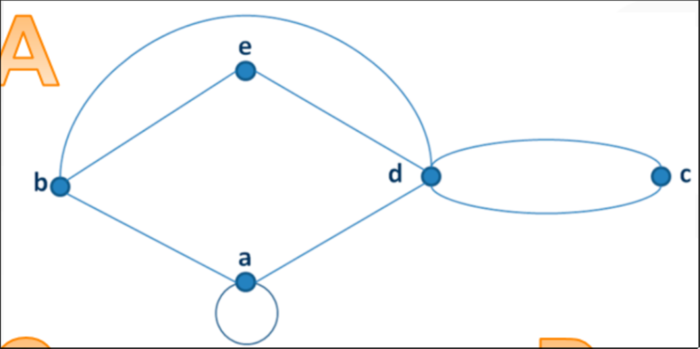
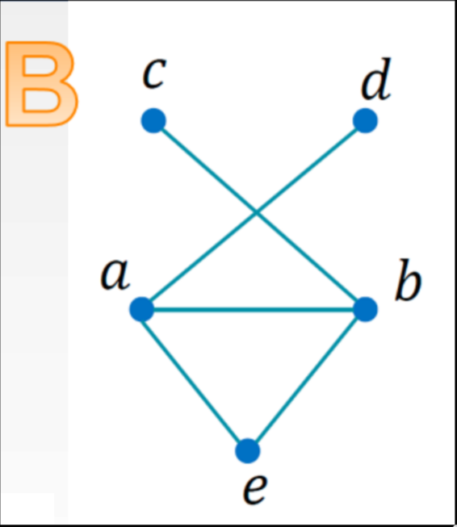
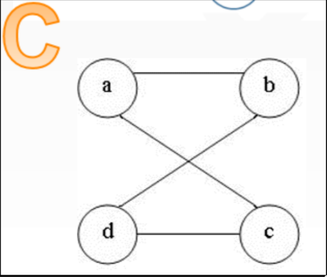
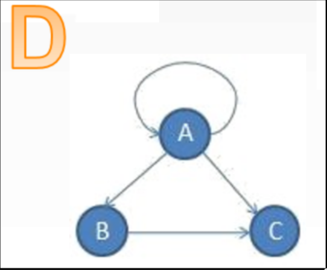

# Caracteriza cada uno de estos grafos

1. Es un [[1706783756-pseudografo|pseudografo]]

2. Es un [[1706783358-grafo-simple|grafo simple]]

3. Es un [[1706783358-grafo-simple|grafo simple]]

 

4. Es un [[1706783756-pseudografo|pseudografo]] [[1706783907-grafo-dirigido|dirigido]]

