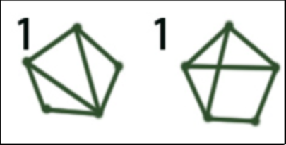
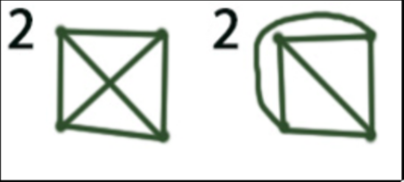
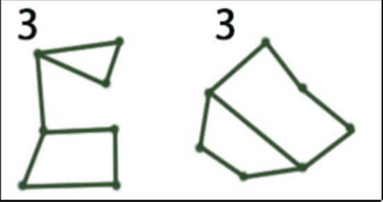
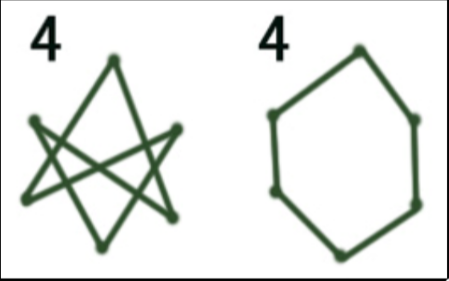
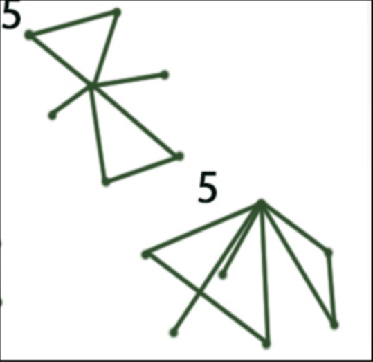

# Que representaciones son equivalentes

1. No son equivalentes, ya en uno tenemos un vértice con 3 aristas y en el otro no

2. Son equivalentes 

3. No son equivalentes

4. Son equivalentes

5. Son equivalentes

