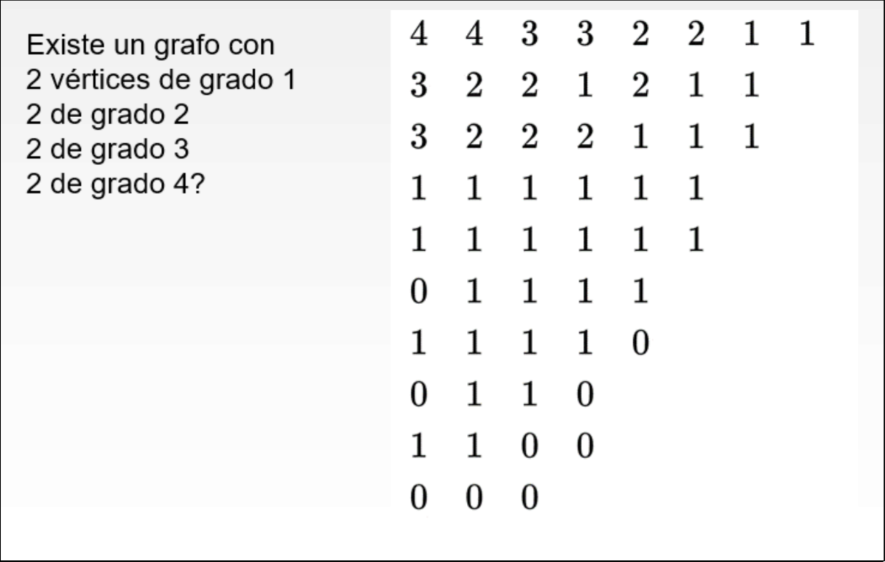

# Algoritmo de Havel-Hakimi

1. Ordenamos los vértices de mayor a menor [[1706785520-grado-de-un-vrtice|grado]]
2. Eliminamos el vértice de mayor grado (pongamos, de grado $d$) y restamos $1$ a los $d$ vértices siguientes
3. Reordenamos los vértices y volvemos al paso $2$
4. Si llegamos a una serie de $0$, el [[1706782930-grafo|grafo]] existe, si no, no existe 

## Ejemplo

