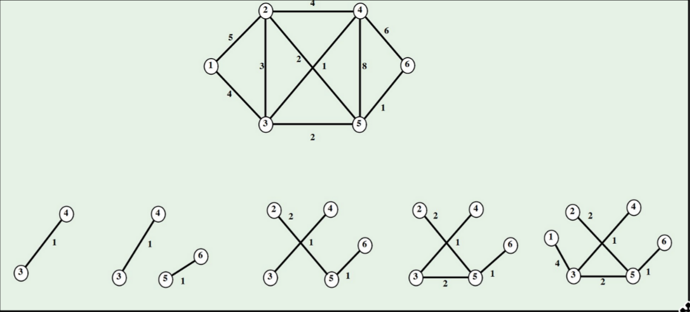

# Algoritmo de Krusal

El algoritmo de Kruskal es un algoritmo de la teoría de [[1706782930-grafo|grafos|]] para encontrar un [[1708533762-rbol-recubridor|árbol recubridor]] mínimo en un [[1706786979-grafo-conexo|grafo conexo]] [[1707741859-grafo-ponderado|ponderado]]. El algoritmo de Kruskal es un algoritmo voraz que encuentra un camino mínimo en un grafo.

## Descripción

1. Se parte del árbol vacío
2. Se le añade la arista de menor peso
3. Se van eligiendo aristas de menor peso entre las restantes
4. Para cada arista nueva se comprueba si al añadirla al [[1707740764-rbol|árbol]] no se forman [[1706786950-ciclo|ciclos]]. En este caso, se añade
5. Volvemos al paso 3 hasta que el árbol tenga $n-1$ aristas

