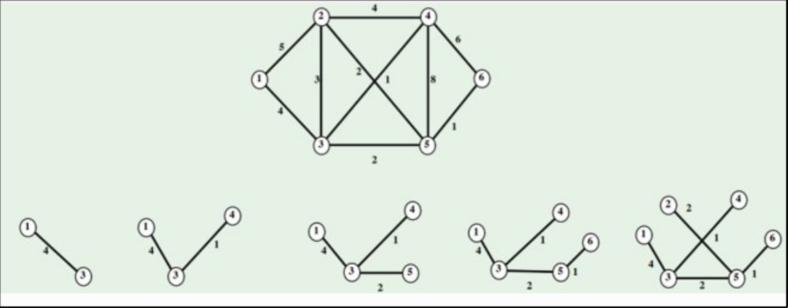

# Algoritmo de Prim

El algoritmo de Prim es un algoritmo de la teoría de [[1706782930-grafo|grafos]] para encontrar un [[1708533762-rbol-recubridor|árbol recubridor]] mínimo en un [[1706786979-grafo-conexo|grafo conexo]] [[1707741859-grafo-ponderado|ponderado]]. El algoritmo de Prim es un algoritmo voraz que encuentra un camino mínimo en un grafo.

## Descripción

1. Partimos de un vértice arbitrario
2. Entre las aristas adyacentes elegimos la que tiene menor peso. Será la primera arista del [[1707740764-rbol|árbol]] que estamos construyendo
3. Entre los vértices adyacentes al árbol hallamos la arista que menor peso tien. Si no forma [[1708598061-cilo|cilos]], la añadimos al árbol
4. Repetimos el paso 3 hasta que el árbol tenga $n-1$ aristas

