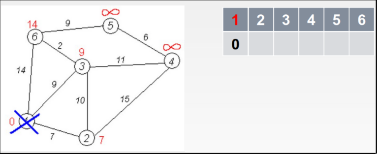

# Algoritmo de Dijkstra

Permite encontrar el camino más corto de un vértice a todos los demás, tiene una complejidad de $O(|V|^2 + |A|)$

## Descripción

1. Fijamos la distancia a todos los vértices a infinito
2. Fijamos el vértice de partida y [[1716491727-mtrica|distancia]] hasta él $= 0$. Lo marcamos como visitado
3. Creamos una tabla de $N \times 2$. En la primera fila colocamos todos los vértices. En la segunda escribimos la distancia a todos los vértices (al principio, la distancia al vértice de partida es $0$ y a las demás es $\infty$)
4. Buscamos el vértice de menor distancia $M$. Lo marcamos como visitado. Miramos todos los vértices adyacentes no visitados. Si la distancia al vértice de partida pasando por $M$ disminuye, la cambiamos y (¡importante!) en la tabla de vértices añadimos una nueva fila con las distancias recalculadas y señalando en negrita el vértice $M$
5. Si no hemos visitado todos los vértices, volvemos al paso 4

## Apunte

- Si en alguno de los pasos la distancia aumenta, mantenemos la distancia anterior y no la cambiamos
- La distancia la los vértices ya visitados no se cambia
