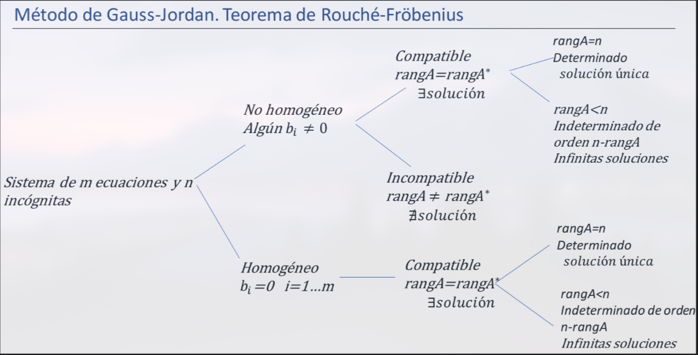

# Teorema de Rouché-Fröbenius

- El [[1709024526-sistema-de-ecuaciones-lineales|sistema de ecuaciones]] $AX=B$ es [[1709028361-sistema-compatible|compatible]] si y sólo si el [[1708971315-rango-de-una-matriz|rango]] de la [[1709025451-expresin-matricial-de-un-sistema-de-ecuaciones|matriz de los coeficientes]] es igual al rango de la [[1709026281-matriz-ampliada|matriz ampliada]].

- Si el rango de $A$ es igual al número de incógnitas $n$, entonces el sistema es [[1709028422-sistema-compatible-determinado|compatible determinado]].

- Si el rango de $A$ es menor que el número de incógnitas $n$, entonces el sistema es [[1709028470-sistema-compatible-indeterminado|compatible indeterminado]] de orden $n-rango(A)$.

