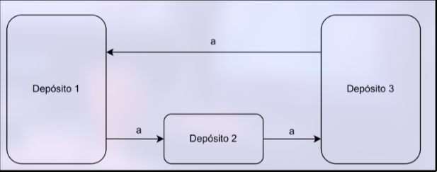

# Actividad 4

1. Dado el siguiente [[1714749015-sistema-de-ecuaciones-difereciales-autnomo|sistema de ecuaciones diferenciales]], obtén una solución particular del sistema completo:

$$
\begin{cases}
    & x' = x + y + z\\
    & y' = 3y + 2z\\
    & z' = 5z + \cos (t)
\end{cases}
$$
Reescribimos el sistema:
$$
\begin{split}
	& \vec{y}' = \begin{pmatrix}
		1 & 1 & 1\\
		0 & 3 & 2\\
		0 & 0 & 5
	\end{pmatrix} \vec{y} + \begin{pmatrix}
		0\\
		0\\
		cos(t)
	\end{pmatrix} \iff\\
	&\vec{y}' = A \cdot \vec{y} + \vec{f}
\end{split}
$$

Hacemos una predicción de la solución particular

$$
\begin{split}
	& \vec{f}(t) = \cos(t) \begin{pmatrix}0\\0\\1\end{pmatrix}\\
	& \vec{y}_p = \cos(t) \vec{a}\\
	& \begin{cases}
		& \vec{y}_p' = -\sin(t)\vec{a}\\
		& \vec{y}_p' = A \cdot \cos(t) \cdot \vec{a} + \cos(t) \begin{pmatrix}0\\0\\1\end{pmatrix}
	\end{cases}
\end{split}
$$

Como el sistema no es homogéneo, primero se resuelve el sistema homogéneo:

Autovalores:

$$
\begin{split}
    & |A| = \begin{vmatrix}
        1-\lambda & 1 & 1 \\
        0 & 3-\lambda & 2 \\
        0 & 0 & 5  -\lambda
    \end{vmatrix} = \\
    & = (1-\lambda)\begin{vmatrix}
        3-\lambda & 2 \\
        0 & 5 -\lambda
    \end{vmatrix} =\\
    & = (1-\lambda)(3-\lambda)(5 -\lambda) = 0\implies\\
    & \implies \lambda_1 = 1, \lambda_2 = 3, \lambda_3 = 5
\end{split}
$$

Autovectores asociados a $\lambda_1 = 1$:

$$
\begin{split}
    &  \begin{pmatrix}
        0 & 1 & 1 \\
        0 & 2 & 2 \\
        0 & 0 & 4
    \end{pmatrix} \cdot \begin{pmatrix}
        x\\
        y\\
        z
    \end{pmatrix} = \begin{pmatrix}
        0 \\
        0 \\
        0
    \end{pmatrix}\\
    & \begin{cases}
        & y + z = 0\\
        & z = 0
    \end{cases}\\
    & S_{\lambda = 1} = \{(x,0,0)\} \implies\\
    & B_{S_{\lambda = 1}} = \{(1,0,0)\}
\end{split}
$$

Autovectores asociados a $\lambda_2 = 3$:

$$
\begin{split}
    & \begin{pmatrix}
        -2 & 1 & 1 \\
        0 & 0 & 2 \\
        0 & 0 & 2
    \end{pmatrix} \implies\\
    & \begin{cases}
        & -2x + y + z = 0\\
        & z = 0
    \end{cases} \implies\\
    & \begin{cases}
        & y = 2x\\
        & z = 0
    \end{cases} \implies\\
    &S_{\lambda = 3} = \{(x,2x,0)\} \implies\\
    & B_{S_{\lambda = 3}} = \{(1,2,0)\}
\end{split}
$$

Autovectores asociados a $\lambda_3 = 5$:

$$
\begin{split}
    & \begin{pmatrix}
        -4 & 1 & 1 \\
        0 & -2 & 2 \\
        0 & 0 & 0
    \end{pmatrix} \implies\\
    & \begin{cases}
        & -4x + y + z = 0\\
        & -2y + 2z = 0
    \end{cases} \implies\\
    & \begin{cases}
        & y = z\\
        & -4x + 2z = 0
    \end{cases} \implies\\
    & \begin{cases}
        & y = z\\
        & x = \frac{z}{2}
    \end{cases} \implies\\
    & S_{\lambda = 5} = \left\{ \left( \frac{z}{2}, z, z \right) \right\} \implies\\
    & B_{S_{\lambda = 5}} = \left\{ \left( \frac{1}{2}, 1, 1 \right) \right\}\\
    & B_{S_{\lambda = 5}} = \{ (1, 2, 2) \}
\end{split}
$$

Entonces:

$$
\begin{split}
    & \begin{pmatrix}
        x\\
        y\\
        z
    \end{pmatrix} = C_1 \begin{pmatrix}
        1\\
        0\\
        0
    \end{pmatrix} e^t + C_2 \begin{pmatrix}
        1\\
        2\\
        0
    \end{pmatrix} e^{3t} + C_3 \begin{pmatrix}
        1\\
        2\\
        2
    \end{pmatrix} e^{5t}
\end{split}
$$

Por lo tanto, la solución general del sistema homogéneo es:

$$
\begin{cases}
    & x = C_1 e^t + C_2 e^{3t} + C_3 e^{5t}\\
    & y = 2C_2 e^{3t} + 2C_3 e^{5t}\\
    & z = 2C_3 e^{5t}
\end{cases}
$$

Ahora calculamos una solución particular de sistema de ecuaciones, para ello usaremos el método de coeficientes indeterminados.

- Tenemos $s(x) = \cos(x)$, por lo tanto:

$$
\begin{split}
	& s(x) = e^{\alpha x}(P_m(x)\sin(\beta x) + Q_n(x)\cos(\beta x)) \implies\\
	& \alpha = 0\\
	& \beta = 1\\
	& P_m = Q_m = 0 \implies k = 0\\
	& \alpha + i \beta = i \implies t = 0
\end{split}
$$
Entonces las soluciones serán de la forma:

$$
\begin{split}
	& x^t(A_kx^k + \ldots + A_0)e^{\alpha x}\sin(\beta x) + x^t(B_kx^k + \ldots + B_0)e^{\alpha x}\cos(\beta x)\\
	& A_0 \sin(x) + B_0 \cos(x)
\end{split}
$$

Por lo tanto si sustituimos en el sistema:

$$
\begin{cases}
	x = a \sin(t) + b\cos(t)\\
	y = c \sin(t) + d \cos(t)\\
	z = e \sin(t) + f \cos(t)
\end{cases}
$$
Entonces al derivar:

$$
\begin{cases}
	x' = a\cos(t) - b\sin(t)\\
	y' = c \cos(t) - d \sin(t)\\
	z' = e \cos(t) - f \sin(t)
\end{cases}
$$
Ahora si sustituimos los resultados en el sistema no homogéneo obtenemos:

$$
\left\{\begin{gathered}
-e-c-a-b=0\\
a-f-d-b=0\\
-2\,e-3\,c-d=0\\
c-2\,f-3\,d=0\\e-5\,f=1\\-5\,e-f=0
\end{gathered}\right.
$$

Resolviendo:

$$
\left\{\begin{gathered}b=\dfrac{7}{130}\\a=-\dfrac{2}{65}\\d=\dfrac{7}{65}\\c=-\dfrac{4}{65}\\f=-\dfrac{5}{26}\\e=\dfrac{1}{26}\end{gathered}\right.
$$

Entonces nuestra solución particular será:

$$
Y_P=\left\{\begin{gathered}x=\dfrac{7\,\cos\left(t\right)}{130}-\dfrac{2\,\sin\left(t\right)}{65}\\y=\dfrac{7\,\cos\left(t\right)}{65}-\dfrac{4\,\sin\left(t\right)}{65}\\z=\dfrac{\sin\left(t\right)}{26}-\dfrac{5\,\cos\left(t\right)}{26}\end{gathered}\right.
$$

Por lo que la solución general de la ecuación completa es:

$$
\begin{cases}
    & x = C_1 e^t + C_2 e^{3t} + C_3 e^{5t} + \dfrac{7\,\cos\left(t\right)}{130}-\dfrac{2\,\sin\left(t\right)}{65}\\
    & y = 2C_2 e^{3t} + 2C_3 e^{5t} + \dfrac{7\,\cos\left(t\right)}{65}-\dfrac{4\,\sin\left(t\right)}{65}\\
    & z = 2C_3 e^{5t} + \dfrac{\sin\left(t\right)}{26}-\dfrac{5\,\cos\left(t\right)}{26}
\end{cases}
$$

2. La siguiente imagen muestra un sistema cerrado con tres depósitos de salmuera con volúmenes $V_{1}=50$ litros, $V_{2} = 25$ litros y $V_{3} = 50$ litros, donde el flujo entre depósitos es $a = 10 \text{ listros/minuto }$. Si las cantidades iniciales de sal en gramos en los tres depósitos son $x_{1}(0)=100, x_{2}(0)=70, x_{3}(0)=10$, obtén las expresiones de las cantidades de sal en cada depósito en cualquier instante de tiempo. Incluye un gráfico donde se pueda ver la evolución de $x_{1}(t),x_{2}(t)$ y $x_{3}(t)$ para $t>0$.

$$
\begin{split}
    & \begin{cases}
        & x'_{1} = -\frac{a}{V_{1}}x_{1} + \frac{a}{V_{2}}x_{3}\\
        & x'_{2} = \frac{a}{V_{1}}x_{1} - \frac{a}{V_{2}}x_{2}\\
        & x'_{3} = \frac{a}{V_{2}}x_{2} - \frac{a}{V_{3}}x_{3}
    \end{cases} \implies
    \begin{cases}
        & x'_{1} = -\frac{1}{5}x_{1} + \frac{1}{5}x_{3}\\
        & x'_{2} = \frac{1}{5}x_{1} - \frac{2}{5}x_{2}\\
        & x'_{3} = \frac{2}{5}x_{2} - \frac{1}{5}x_{3}
    \end{cases}
\end{split}
$$

Autovalores:

$$
\begin{split}
    & |A| = \begin{vmatrix}
        -\frac{1}{5}-\lambda & 0 & \frac{1}{5} \\
        \frac{1}{5} & -\frac{2}{5}-\lambda & 0 \\
        0 & \frac{2}{5} & -\frac{1}{5}-\lambda
    \end{vmatrix} = \\
    & = -\lambda^3 - \lambda^2 \frac{4}{5}-\lambda\frac{1}{5}\\
    & 5\lambda^3 + 4\lambda^2 + \lambda = 0\\
    & \lambda_{1} = 0, \quad \lambda_{2} = -\frac{2}{5} - \frac{i}{5}, \quad \lambda_{3} = -\frac{2}{5} + \frac{i}{5} 
\end{split}
$$

Autovectores asociados a $\lambda_1 = 0$:

$$
\begin{split} -\frac{3}{4}
    & S_{\lambda = 0} = \left\{ (x,y,z) :
    \begin{pmatrix}
        -\frac{1}{5} & 0 & \frac{1}{5} \\
        \frac{1}{5} & -\frac{2}{5} & 0 \\
        0 & \frac{2}{5} & -\frac{1}{5}
    \end{pmatrix} \begin{pmatrix}
        x\\
        y\\
        z
    \end{pmatrix} = \begin{pmatrix}
        0\\
        0\\
        0
    \end{pmatrix} \right\}\\
    & \begin{pmatrix}
        -\frac{1}{5} & 0 & \frac{1}{5} \\
        \frac{1}{5} & -\frac{2}{5} & 0 \\
        0 & \frac{2}{5} & -\frac{1}{5}
    \end{pmatrix} \sim 
    \begin{pmatrix}
        1 & 0 & -1 \\
        1 & -2 & 0 \\
        0 & 2 & -1
    \end{pmatrix} \sim\\
    & \sim \begin{pmatrix}
        1 & 0 & -1 \\
        0 & -2 & 1 \\
        0 & 2 & -1
    \end{pmatrix} \sim
    \begin{pmatrix}
        1 & 0 & -1 \\
        0 & -2 & 1 \\
        0 & 0 & 0
    \end{pmatrix} \implies\\
    & \begin{cases}
        & x - z = 0\\
        & -2y + z = 0
    \end{cases} \implies
    \begin{cases}
        & z = x\\
        & z = 2y
    \end{cases} \implies\\
    & S_{\lambda = 0} = \left\{ \left( z, \frac{z}{2}, z \right), z \in \mathbb{R}  \right\} \implies\\
    & B_{S_{\lambda = 0}} = \left\{ \left( 1, \frac{1}{2}, 1 \right) \right\}
\end{split}
$$

Autovectores asociados a $\lambda_2 = -\frac{2}{5} - \frac{i}{5}$:

$$
\begin{split}
    & S_{\lambda = -\frac{2}{5} - \frac{i}{5}} =\\
    & = \left\{ \begin{pmatrix}
        x\\
        y\\
        z
    \end{pmatrix} : 
    \begin{pmatrix}
        -\frac{1}{5} + \frac{2}{5} + \frac{i}{5} & 0 & \frac{1}{5} \\
        \frac{1}{5} & -\frac{2}{5} + \frac{2}{5} + \frac{i}{5} & 0 \\
        0 & \frac{2}{5} & -\frac{1}{5} + \frac{2}{5} + \frac{i}{5}
    \end{pmatrix} \begin{pmatrix}
        x\\
        y\\
        z
    \end{pmatrix} = \begin{pmatrix}
        0\\
        0\\
        0
    \end{pmatrix} \right\}=\\
    & = \left\{ \begin{pmatrix}
        x\\
        y\\
        z
    \end{pmatrix} :
    \begin{pmatrix}
        \frac{1}{5} + \frac{i}{5} & 0 & \frac{1}{5} \\
        \frac{1}{5} & \frac{i}{5} & 0 \\
        0 & \frac{2}{5} & \frac{1}{5} + \frac{i}{5}
    \end{pmatrix} \begin{pmatrix}
        x\\
        y\\
        z
    \end{pmatrix} = \begin{pmatrix}
        0\\
        0\\
        0
    \end{pmatrix} \right\} \\
    & \begin{pmatrix}
       \frac{1}{5} + \frac{i}{5} & 0 & \frac{1}{5}\\
       \frac{1}{5} & \frac{i}{5} & 0\\
       0 & \frac{2}{5} & \frac{1}{5} + \frac{i}{5}
     \end{pmatrix}
     \sim \begin{pmatrix}
        1 + i & 0 & 1\\
        1 & i & 0\\
        0 & 2 & 1 + i
        \end{pmatrix} \sim\\
     & \sim \begin{pmatrix}
            & 1 & i & 0\\
            & 1 + i & 0 & 1\\
            & 0 & 2 & 1 + i
      \end{pmatrix}
      \sim \begin{pmatrix}
            & 1 & i & 0\\
            & 0 & 1 - i & 1\\
            & 0 & 2 & 1 + i
      \end{pmatrix} \sim\\
      & \sim \begin{pmatrix}
            & 1 & i & 0\\
            & 0 & 1 & \frac{1+i}{2}\\
            & 0 & 1-i & 1
      \end{pmatrix} \sim
      \begin{pmatrix}
            & 1 & i & 0\\
            & 0 & 1 & \frac{1+i}{2}\\
            & 0 & 0 & 0
      \end{pmatrix} \implies\\
      & \begin{cases}
            & x + iy = 0\\
            & y + \frac{1+i}{2}z = 0
        \end{cases} \implies
        \begin{cases}
            & x = -iy\\
            & z = -\frac{1+i}{2}y
        \end{cases} \implies\\
        & S_{\lambda = -\frac{2}{5} - \frac{i}{5}} = \left\{ \left( -iy, y, -\frac{1+i}{2}y \right), \; y \in \mathbb{R} \right\} \implies\\
        & B_{S_{\lambda = -\frac{2}{5} - \frac{i}{5}}} = \left\{ \left( -i, 1, -\frac{1+i}{2} \right) \right\}
\end{split}
$$

Autovectores asociados a $\lambda_3 = -\frac{2}{5} + \frac{i}{5}$:

$$
\begin{split}
    & S_{\lambda = -\frac{2}{5} + \frac{i}{5}} =\\
    & = \left\{ \begin{pmatrix}
        x\\
        y\\
        z
    \end{pmatrix} :
    \begin{pmatrix}
        -\frac{1}{5} + \frac{2}{5} - \frac{i}{5} & 0 & \frac{1}{5} \\
        \frac{1}{5} & -\frac{2}{5} + \frac{2}{5} - \frac{i}{5} & 0 \\
        0 & \frac{2}{5} & -\frac{1}{5} + \frac{2}{5} - \frac{i}{5}
    \end{pmatrix} \begin{pmatrix}
        x\\
        y\\
        z
    \end{pmatrix} = \begin{pmatrix}
        0\\
        0\\
        0
    \end{pmatrix} \right\}=\\
    & = \left\{ \begin{pmatrix}
        x\\
        y\\
        z
    \end{pmatrix} :
    \begin{pmatrix}
        \frac{1}{5} - \frac{i}{5} & 0 & \frac{1}{5} \\
        \frac{1}{5} & -\frac{i}{5} & 0 \\
        0 & \frac{2}{5} & \frac{1}{5} - \frac{i}{5}
    \end{pmatrix} \begin{pmatrix}
        x\\
        y\\
        z
    \end{pmatrix} = \begin{pmatrix}
        0\\
        0\\
        0
    \end{pmatrix} \right\} \\
    & \begin{pmatrix}
        & \frac{1}{5} - \frac{i}{5} & 0 & \frac{1}{5}\\
        & \frac{1}{5} & -\frac{i}{5} & 0\\
        & 0 & \frac{2}{5} & \frac{1}{5} - \frac{i}{5}
    \end{pmatrix} \sim 
    \begin{pmatrix}
        1 - i & 0 & 1\\
        1 & -i & 0\\
        0 & 2 & 1 - i
    \end{pmatrix} \sim\\
    & \sim \begin{pmatrix}
        & 1 & -i & 0\\
        & 1 - i & 0 & 1\\
        & 0 & 2 & 1 - i
    \end{pmatrix} \sim
    \begin{pmatrix}
        & 1 & -i & 0\\
        & 0 & 1 + i & 1\\
        & 0 & 2 & 1 - i
    \end{pmatrix} \sim\\
    & \sim \begin{pmatrix}
        & 1 & -i & 0\\
        & 0 & 1 & \frac{1-i}{2}\\
        & 0 & 0 & 0
    \end{pmatrix} \implies\\
    & \begin{cases}
        & x - iy = 0\\
        & y + \frac{1-i}{2}z = 0
    \end{cases} \implies
    \begin{cases}
        & x = iy\\
        & z = -\frac{1-i}{2}y
    \end{cases} \implies\\
    & S_{\lambda = -\frac{2}{5} + \frac{i}{5}} = \left\{ \left( iy, y, -\frac{1-i}{2}y \right), \; y \in \mathbb{R} \right\} \implies\\
    & B_{S_{\lambda = -\frac{2}{5} + \frac{i}{5}}} = \left\{ \left( i, 1, -\frac{1-i}{2} \right) \right\}
\end{split}
$$

Por lo tanto, los autovectores son:

$$
\begin{split}
    & B_{S_{\lambda = 0}} = \left\{ \left( 1, \frac{1}{2}, 1 \right) \right\}\\
    & B_{S_{\lambda = -\frac{2}{5} - \frac{i}{5}}} = \left\{ \left( -i, 1, -\frac{1+i}{2} \right) \right\}\\
    & B_{S_{\lambda = -\frac{2}{5} + \frac{i}{5}}} = \left\{ \left( i, 1, -\frac{1-i}{2} \right) \right\}
\end{split}
$$

Entonces, la solución general es:

$$
\begin{split}
    & \begin{pmatrix}
        x_1\\
        x_2\\
        x_3
    \end{pmatrix} = C_1 \begin{pmatrix}
        1\\
        \frac{1}{2}\\
        1
    \end{pmatrix} e^{0t} + C_2 \begin{pmatrix}
        -i\\
        1\\
        \frac{-1-i}{2}
    \end{pmatrix} e^{-\frac{2}{5} - \frac{i}{5}t} + C_3 \begin{pmatrix}
        i\\
        1\\
        \frac{-1+i}{2}
    \end{pmatrix} e^{-\frac{2}{5} + \frac{i}{5}t} =\\
    & = C_1 \begin{pmatrix}
        1\\
        \frac{1}{2}\\
        1
    \end{pmatrix} + 2Re \left( (a + bi) \begin{pmatrix}
        & -i\\
        & 1\\
        & \frac{-1-i}{2}
    \end{pmatrix} e^{-\frac{2}{5}t} \left( \cos \left( \frac{t}{5} \right) + i \sin \left( \frac{t}{5} \right)\right)\right) =\\
    & = C_1 \begin{pmatrix}
        1\\
        \frac{1}{2}\\
        1
    \end{pmatrix} + 2 e^{-\frac{2}{5}t} \left( 
    \begin{pmatrix}
        & b - ai\\
        & a + bi\\
        & \frac{-a+b-i(a+b)}{2}
    \end{pmatrix} \left ( \cos \left( \frac{t}{5} \right) + i \sin \left( \frac{t}{5} \right) \right) \right) =\\
    & = C_1 \begin{pmatrix}
        1\\
        \frac{1}{2}\\
        1
    \end{pmatrix} + 2 e^{\frac{-2}{5}t}\begin{pmatrix}
		b \cos(\frac{t}{5}) + a \sin(\frac{t}{5})\\
		a \cos(\frac{t}{5}) - b \sin(\frac{t}{5})\\
		\frac{-a + b}{2}cos(\frac{t}{5}) + \frac{a+b}{2}\sin(\frac{t}{5})
	\end{pmatrix} \implies\\
    & \begin{cases}
        & x_1 = C_1 + 2e^{-\frac{2}{5}t} \left( b \cos \left( \frac{t}{5} \right) + a \sin \left( \frac{t}{5} \right) \right)\\
        & x_2 = \frac{1}{2}C_1 + 2e^{-\frac{2}{5}t} \left( a \cos \left( \frac{t}{5} \right) - b \sin \left( \frac{t}{5} \right) \right)\\
        & x_3 = C_1 + 2e^{-\frac{2}{5}t} \left( \frac{-a + b}{2} \cos \left( \frac{t}{5} \right) + \frac{a+b}{2} \sin \left( \frac{t}{5} \right) \right)
    \end{cases} \implies\\
    & \begin{cases}
        & x_1 = C_1 + e^{-\frac{2}{5}t} \left( C_{3} \cos \left( \frac{t}{5} \right) + C_{2} \sin \left( \frac{t}{5} \right) \right)\\
        & x_2 = \frac{C_{1}}{2} + e^{-\frac{2}{5}t} \left( C_{2} \cos \left( \frac{t}{5} \right) - C_{3} \sin \left( \frac{t}{5} \right) \right)\\
        & x_3 = C_1 + e^{-\frac{2}{5}t} \left( \frac{-C_{2} + C_{3}}{2} \cos \left( \frac{t}{5} \right) + \frac{C_{2}+C_{3}}{2} \sin \left( \frac{t}{5} \right) \right)
    \end{cases}
\end{split}
$$

Como $x_{1}(0)=100, x_{2}(0)=70, x_{3}(0)=10$ hay que encontrar los $C_1, C_2$ y $C_3$ adecuados:

$$
\begin{split}
    & \begin{cases}
        & x_{1}(0) = C_1 + C_3 = 100\\
        & x_{2}(0) = \frac{C_1}{2} + C_2 = 70\\
        & x_{3}(0) = C_1  - \frac{C_2}{2} + \frac{C_3}{2} = 10
    \end{cases} \implies 
    \left(\begin{array}{ccc|c}
        1 & 0 & 1 & 100\\
        \frac{1}{2} & 1 & 0 & 70\\
        1 & -\frac{1}{2} & \frac{1}{2} & 10
    \end{array}\right) \sim\\
    & \sim \left(\begin{array}{ccc|c}
        1 & 0 & 1 & 100\\
        0 & 1 & -\frac{1}{2} & 20\\
        0 & -\frac{1}{2} & -\frac{1}{2} & -90
    \end{array}\right) \sim
    \left(\begin{array}{ccc|c}
        1 & 0 & 1 & 100\\
        0 & 1 & -\frac{1}{2} & 20\\
        0 & 0 & -\frac{3}{4} & -80
    \end{array}\right) \implies\\
    &\begin{cases}
        & C_{1} = -\frac{20}{3}\\
        & C_{2} = \frac{220}{3}\\
        & C_{3} = \frac{320}{3}
    \end{cases}
\end{split}
$$
s
Por lo tanto, la solución particular es:

$$
\begin{cases}
    & x_{1} = -\frac{20}{3} + e^{-\frac{2}{5}t}\frac{320}{3} \cos \left( \frac{t}{5} \right) + e^{-\frac{2}{5}t}\frac{220}{3} \sin \left( \frac{t}{5} \right) \\
    & x_{2} = -\frac{10}{3} + e^{-\frac{2}{5}t}\frac{220}{3} \cos \left( \frac{t}{5} \right) - e^{-\frac{2}{5}t}\frac{320}{3} \sin \left( \frac{t}{5} \right)\\
    & x_{3} = -\frac{20}{3} + e^{-\frac{2}{5}t}\frac{50}{3}\cos(\frac{t}{5}) + e^{-\frac{2}{5}t}90\sin(\frac{t}{5})
\end{cases}
$$

![[actividad-4-ecuaciones-diferenciales.png]]
