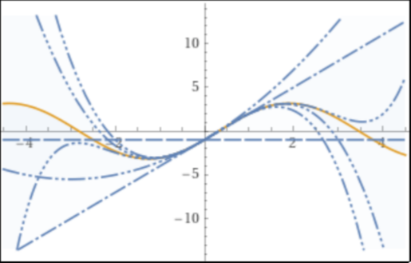

# Laboratorio 2

### Problema 1: Interpolación de Taylor

1. Sabiendo que el polinomio de Taylor de grado $\le N$ de $e^{x}$ en $x_{0}=0$ es ${1 + x + \frac{x^2}{2!} + \ldots + \frac{x^{N}}{N!}}$, escriba el polinomio de Taylor de grado $\leq 4$ en $x_{0}=0$ de la función $f(x) = (1+x)e^{x}$. (No es preciso saber derivar para contestar)

- Sabemos que el polinomio de Taylor de $f_{1}(x) = (1+x)$ es el propio polinomio

- Aplicando la linealidad del polinomio de Taylor, el polinomio de Taylor de $f(x) = (1+x)e^{x} = f_{1}(x)f_{2}(x)$ es el producto de los polinomios de Taylor $P(x) = P_{1}(x)P_{2}(x)$.

$$
\begin{split}
    & P_{1}(x) = 1 + x\\
    & P_{2}(x) = 1 + x + \frac{x^2}{2!} + \frac{x^3}{3!} + \frac{x^4}{4!}\\
    & P(x) = P_{1}(x)P_{2}(x) = (1 + x)(1 + x + \frac{x^2}{2!} + \frac{x^3}{3!} + \frac{x^4}{4!}) \Longleftrightarrow\\
    & P(x) = 1 + x + \frac{x^2}{2!} + \frac{x^3}{3!} + \frac{x^4}{4!} + x + x^2 + \frac{x^3}{2!} + \frac{x^4}{3!} + \frac{x^5}{4!} \Longleftrightarrow\\
    & P(x) = 1 + 2x + \frac{3x^2}{2} + \frac{4x^3}{6} + \frac{5x^4}{24} \Longleftrightarrow\\
    & P(x) = 1 + 2x + \frac{3x^2}{2} + \frac{2x^3}{3} + \frac{5x^4}{24} \Longleftrightarrow\\
    & P(x) = \frac{5}{24}x^4 + \frac{2}{3}x^3 + \frac{3}{2}x^2 + 2x + 1
\end{split}
$$

2. Use las relaciones $1+x=2+(x-1)$ y $e^{x} =e \cdot e^{x-1}$ para hallar el polinomio de Taylor de grado $\leq 4$ de $f(x)$ en $x_{0}=1$.

- Con la información dada, podemos reescribir la función $f(x)$ como:

$$
f(x) = (2 + (x-1)) \cdot e \cdot e^{x-1} = e^{x-1}(2e + e(x-1))
$$

- Aplicando la linealidad del polinomio de Taylor, el polinomio de Taylor de $f(x) = e^{x-1}(2e + e(x-1)) = f_{1}(x)f_{2}(x)$ es el producto de los polinomios de Taylor $P(x) = P_{1}(x)P_{2}(x)$.

- El polinomio de Taylor de $f_{2}(x)=2e + e(x-1)$ es el propio polinomio.

$$
P_{2}(x) = 2e + e(x-1)
$$

- El polinomio de Taylor de $f_{1}(x)=e^{x-1}$ se puede hallar sustituyendo $x-1$ por $x$ en el polinomio de Taylor de $e^{x}$. Esta es una de las propiedades de los polinomios de Taylor.

$$
P_{1}(x) = 1 + (x-1) + \frac{(x-1)^2}{2!} + \frac{(x-1)^3}{3!} + \frac{(x-1)^4}{4!}
$$

- Entonces, el polinomio de Taylor de $f(x)$ en $x_{0}=1$ es:

$$
\begin{split}
    & P(x) = P_{1}(x)P_{2}(x) =\\
    & = \left(1 + (x-1) + \frac{(x-1)^2}{2!} + \frac{(x-1)^3}{3!} + \frac{(x-1)^4}{4!}\right)(2 + (x-1))e \Longleftrightarrow\\
    & P(x) = e\left(1 + (x-1) + \frac{(x-1)^2}{2} + \frac{(x-1)^3}{6} + \frac{(x-1)^4}{24}\right)(2 + (x-1)) =\\
    & = e \left(  2 + 3(x-1) + 2(x-1)^2 + \frac{5}{6}(x-1)^3 + \frac{1}{4}(x-1)^4 + \frac{1}{24}(x-1)^5 \right) \Longleftrightarrow\\
    & P(x) = 2e + 3e(x-1) + 2e(x-1)^2 + \frac{5e}{6}(x-1)^3 + \frac{e}{4}(x-1)^4
\end{split}
$$

- El último elemento $\frac{(x-1)^{5}}{24}$ se ha eliminado ya que $P(x)$ tiene grado $\le 4$

3. Use el algoritmo de Horner reiteradamente para escribir el polinomio del apartado primero en potencias de $x-1$. ¿Coincide el resultado con el polinomio del apartado segundo?. Comente.

Empezamos con el polinomio $P(x) = \frac{5}{24}x^4 + \frac{2}{3}x^3 + \frac{3}{2}x^2 + 2x + 1$ y $x_{0} = 1$.

$$
\begin{split}
	& q_{4} = \frac{5}{24}\\
	& q_{3} = \frac{5}{24} \cdot 1 + \frac{2}{3} = \frac{7}{8}\\
	& q_{2} = \frac{7}{8} \cdot 1 + \frac{3}{2} = \frac{19}{8}\\
	& q_{1} = \frac{19}{8} \cdot 1 + 2 = \frac{35}{8}\\
	& q_{0} = \frac{35}{8} \cdot 1 + 1 = \frac{43}{8}
\end{split}
$$

Ahora, aplicamos el algoritmo de Horner con el polinomio $Q_{1}(x) = \frac{5}{24}x^3 + \frac{7}{8}x^2 + \frac{19}{8}x + \frac{35}{8}$.

$$
\begin{split}
	& q_{3} = \frac{5}{24}\\
	& q_{2} = \frac{5}{24} \cdot 1 + \frac{7}{8} = \frac{13}{12}\\
	& q_{1} = \frac{13}{12} \cdot 1 + \frac{19}{8} = \frac{83}{24}\\
	& q_{0} = \frac{83}{24} \cdot 1 + \frac{35}{8} = \frac{47}{6}
\end{split}
$$

Continuamos aplicando el algoritmo de Horner con el polinomio $Q_{2}(x) = \frac{5}{24}x^2 + \frac{13}{12}x + \frac{83}{24}$.

$$
\begin{split}
	& q_{2} = \frac{5}{24}\\
	& q_{1} = \frac{5}{24} \cdot 1 + \frac{13}{12} = \frac{31}{24}\\
	& q_{0} = \frac{31}{24} \cdot 1 + \frac{83}{24} = \frac{19}{4}
\end{split}
$$

Finalmente, aplicamos el algoritmo de Horner con el polinomio $Q_{3}(x) = \frac{5}{24}x + \frac{31}{24}$.

$$
\begin{split}
	& q_{1} = \frac{5}{24}\\
	& q_{0} = \frac{5}{24} \cdot 1 + \frac{31}{24} = \frac{3}{2}
\end{split}
$$

Entonces, nuestro polinomio en potencias de $x-1$ será:

$$
\begin{split}
    & P(x) = \frac{43}{8} + (x-1)\left(\frac{47}{6} + (x-1)\left(\frac{19}{4} + (x-1)\left(\frac{3}{2} + (x-1) \frac{5}{24} \right)\right)\right) \Longleftrightarrow\\
    & P(x) = \frac{5}{24}(x-1)^{4} + \frac{3}{2}(x-1)^{3} + \frac{19}{4}(x-1)^{2} + \frac{47}{6}(x-1) + \frac{43}{8}
\end{split}
$$

- Los resultados no coinciden, ya que son polinomios con coeficientes diferentes

### Problema 2: Cotas del Error

Se va a calcular aproximadamente $e^{x}$, para valores de $x$ en el intervalo $0 \le x \le 1$, usando un polinomio de Taylor relativo al origen. Se desea que el error absoluto no exceda de cinco millonésimas. ¿Cuál es el menor grado que puede tener el polinomio buscado?

Sabemos que la fórmula del error en Taylor es:

$$
|f(x) - P(x)| \le f^{(n+1)}(c)\frac{|x-0|^{n+1}}{(n+1)!}
$$

En nuestro caso como $x \in [0,1]$ y que $c \in [0, x]$ entonces el máximo valor que se puede alcanzar es cuando $x=1$ y $c=1$. Entonces:

$$
\begin{split}
    & |f(x) - P(x)| \le e^{1}\frac{1^{n+1}}{(n+1)!} \le 5 \times 10^{-6} \iff\\
    & \frac{e}{(n+1)!} \le 0.000005 \iff\\
    & n = 9
\end{split}
$$

Entonces, el menor grado que puede tener el polinomio buscado es $n=9$.

### Problema 3: Convergencia de la sucesión de polinomios de Taylor

Sea $P_{N}$ el polinomio de Taylor de grado $\le N$, relativo al punto $x_{0}=0$, de la función $f(x) = 3 \sin (x) - \cos (x)$.

1. Sea $x$ un número real, arbitrario pero fijo, ¿a qué converge la sucesión $P_{N}(x)$ cuando $N \to \infty$? Haga la demostración.

Si calculamos las derivadas de $f(x)$ veremos que son cíclicas:

$$
\begin{split}
    & f'(x) = 3 \cos (x) - \sin (x)\\
    & f''(x) = -3 \sin (x) - \cos (x)\\
    & f'''(x) = -3 \cos (x) + \sin (x)\\
    & f^{iv)}(x) = 3 \sin (x) + \cos (x)\\
    & f^{v)}(x) = 3 \cos (x) - \sin (x) = f'(x)\\
\end{split}
$$

Ahora si calculamos el límite del error de $P_{N}$ cuando $N \to \infty$:

$$
\begin{split}
    & \lim_{N \to \infty} f^{(N+1)}(c)\frac{|x-0|^{N+1}}{(N+1)!} 
\end{split}
$$

La derivada que nos da un numerador más alto son las que son módulo 4 ($3\sin(x) + \cos(x)$), y los valores más altos que pueden alcanzar el seno y coseno es 1, por lo que el mayor numerador será $3+1=4$

$$
\begin{split}
    & \lim_{N \to \infty} \frac{4x^{N+1}}{(N+1)!} = 0 
\end{split}
$$

Sabemos que el límite da $0$ ya que el factorial crece mucho más rápido que la exponencial. Por lo tanto, como en el infinito el error es nulo, significa que cuando $x \to \infty$ la sucesión $P_{N}(x)$ converge a $f(x)$

$$
\lim_{N \to \infty} = P_{N}(x) = f(x)
$$

2. Sea $N$ un entero $\ge 0$, arbitrario pero fijo, ¿se parecen las gráficas de las funciones $y = P_{N}(x), \; y = f(x)$? Conteste con brevedad.

Sí, las gráficas de las funciones $y = P_{N}(x), \; y = f(x)$ se parecen ya que $P_{N}(x)$ converge a $f(x)$ cuando $N \to \infty$. Cuanto mayor sea $N$ y cuanto más cerca esté $x$ de $0$, más se parecerán las gráficas.

